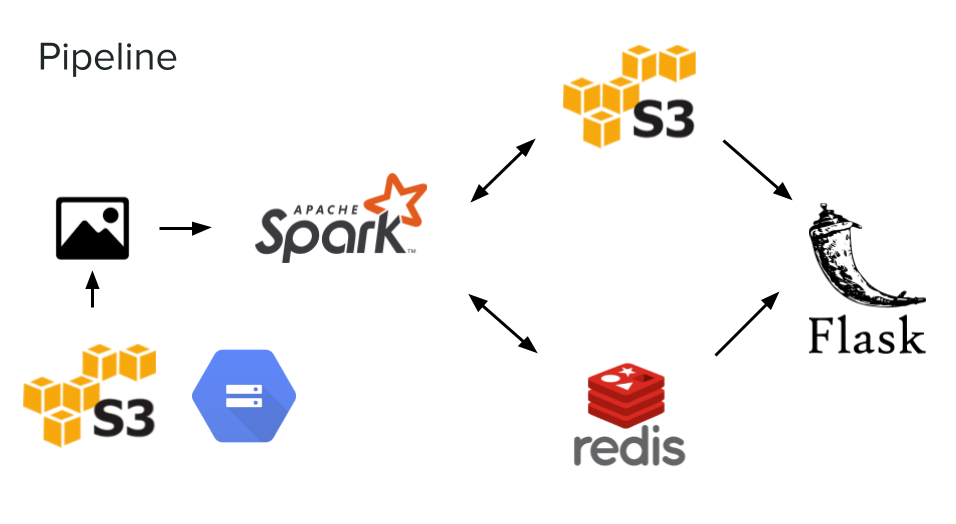

# CopyCatcher - efficient copy finder for large databases

Insight Data Engineering Project
The UI is temporarily displayed on my personal website:
nataliest.com

CopyCatch aims to solve:
- copyright infringement problem
- file duplication problem

After filtering almost two million images by tags in under a second, the app performs MSE-error calculation and Structural Similarity comparison on the filtered images and the incoming image in parallel using Spark. 
The image metadata is stored in Redis.

The results displayed at nataliest.com were obtained using 6 worker nodes and 18 executors 2 cores each.

Dataset:
Open Images Dataset: ~600GB of images with tags.
The dataset csv metadata parsing scripts are not included.
 
